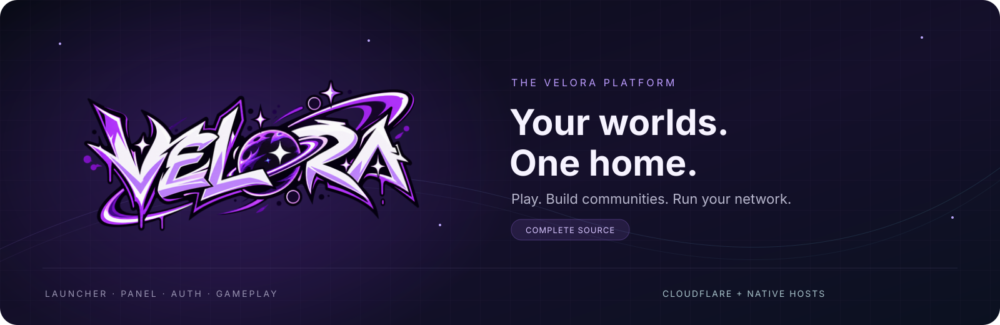
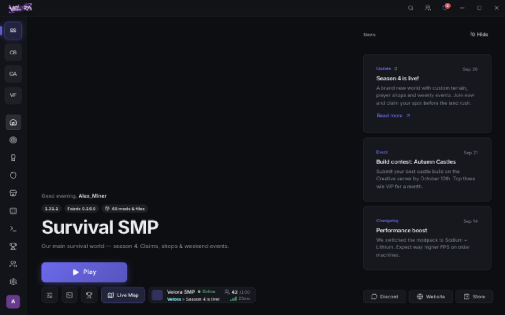
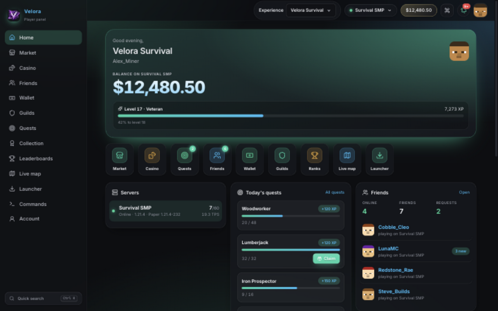
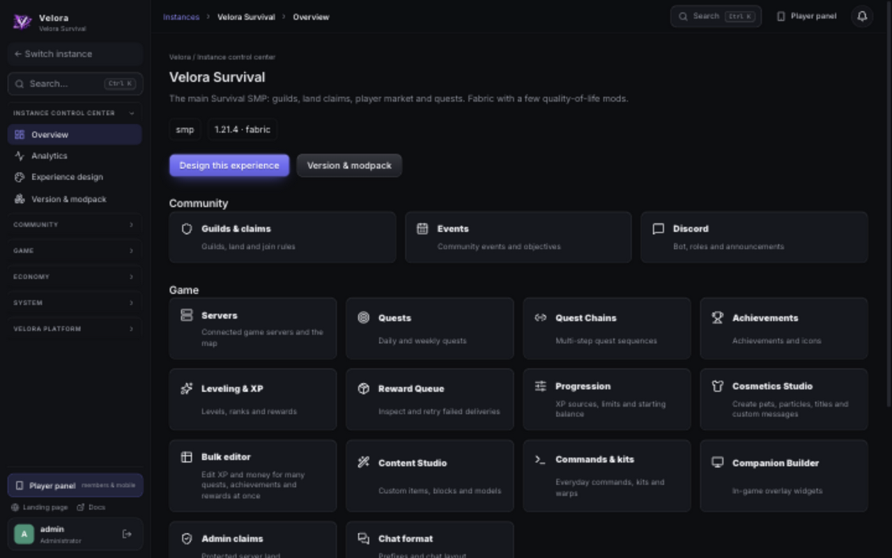

<p align="center">
  
</p>

<p align="center">
  <a href="https://github.com/VeloraMCDev/velora-launcher/actions/workflows/ci.yml"></a>
  
  
  
  <a href="LICENSE.md"></a>
</p>

<p align="center"><strong>A connected home for Minecraft players, communities and operators.</strong><br />
Desktop launcher · Player companion · Network administration · Multi-host deployment</p>

<p align="center">
  <a href="#see-velora">Screenshots</a> ·
  <a href="docs/APPLICATION.md">Get started</a> ·
  <a href="docs/BOUNDARIES.md">Architecture</a> ·
  <a href="docs/deployment/README.md">Deployment</a> ·
  <a href="docs/README.md">Documentation</a>
</p>

---

Velora brings launching, accounts, community features and network operations into
one platform. This repository contains the **complete product source**, including
gameplay, SDKs and deployment tooling. Each segment keeps a clear boundary and
an independent build and release lifecycle.

## Built around your community

| For players | For operators | For builders |
|---|---|---|
| Instance-aware desktop launcher | Instance control center and branding | Reusable Rust, TypeScript and Java libraries |
| Quests, guilds, friends and player markets | Server credentials, progression and content tools | Paper, Fabric and Forge integrations |
| Player website and companion shells | Operations dashboard, signed releases and backups | Shared UI modules and SMP/Frontiers gameplay |

## See Velora

### One launcher, your worlds

Choose an instance, follow community news and jump into the experience.



<table>
  <tr>
    <td width="50%"><strong>A home for your players</strong><br />Progression, quests, friends and auctions in one player dashboard.</td>
    <td width="50%"><strong>A control center for your network</strong><br />Manage the experience, community, game systems and economy.</td>
  </tr>
  <tr>
    <td></td>
    <td></td>
  </tr>
</table>

*Actual UI previews using fictional accounts and demo data. The launcher runs its
browser fixture; Panel views use an isolated local backend. These are development
previews, not a production deployment. [Capture details](.github/assets/README.md).*

## Try it locally

The quickest way to explore the launcher needs **Node 24**:

```sh
git clone https://github.com/VeloraMCDev/velora-launcher.git
cd velora-launcher/launcher
npm ci --no-audit --no-fund
npm run dev
```

Open **http://localhost:1420/?mock=main**. The browser demo uses in-memory fixtures.
Native launching uses Tauri and the target OS toolchain; see the
[launcher guide](launcher/README.md).

To run the complete backend and websites, follow [the application guide](docs/APPLICATION.md).
For a populated local instance, use [the synthetic demo](scripts/demo/README.md).

## Find your part of the platform

| Segment | What's inside |
|---|---|
| [Launcher](launcher/README.md) | Tauri desktop app, instances and client settings |
| [Panel](panel/README.md) | Rust backend, admin/player sites, mobile and the operations dashboard |
| [Authentication & Rust libraries](crates/README.md) | Identity, sessions, gateway and reusable platform services |
| [Minecraft integrations](integrations/README.md) | Loader-specific mods and server plugins |
| [SDK & packages](packages/README.md) | Contracts, clients, platform utilities and gameplay packages |
| [Shared frontend](shared/README.md) | HTTP client, map, board, commands and experience modules |
| [Java gameplay](java/README.md) | Gameplay systems and server composition |
| [Experience UI](ui/README.md) | Instance interfaces and presentation |
| [Infrastructure](infra/README.md) | Single-host deployment and backups, optional Cloudflare control plane |
| [Documentation](docs/README.md) | Development, architecture, operations and security |
| [Branding](branding/README.md) | Original artwork, platform icons and rights |

## One host, fully operated

Production runs on a single Docker host: the Panel, the searchable documentation and
the **operations dashboard**, which shows service health, sign-ins and audit logs,
takes backups, deploys tested builds with automatic rollback and approves launcher
releases before players receive them. Nightly cold backups are verified and copied
offsite, and alerts arrive by email through Resend.

Every artifact comes from a manual release workflow that tests the exact image or
installer before publishing it; launcher installers are signed. The Cloudflare
control plane remains an optional multi-host design. See
[deployment targets](docs/DEPLOYMENT_TARGETS.md) and [infra/vps](infra/vps/README.md).

## Contribute with confidence

Start with [the boundaries](docs/BOUNDARIES.md) and [validation](docs/VALIDATION.md).
Source CI runs automatically on public pull requests and main pushes with read-only
permissions. Native packaging, image acceptance and releases remain manual.

Keep credentials and runtime stores out of Git, use synthetic screenshot data,
and preserve installed identities and persistent state. See
[security and publication](docs/security/README.md).

This is a **mixed-license repository**. Package licenses apply locally; public
source access does not grant a repository-wide MIT license or rights to Velora
artwork and trademarks. Read [the licensing boundaries](LICENSE.md).

---

<p align="center"><strong>Velora owns the platform. Each instance owns the experience.</strong></p>
