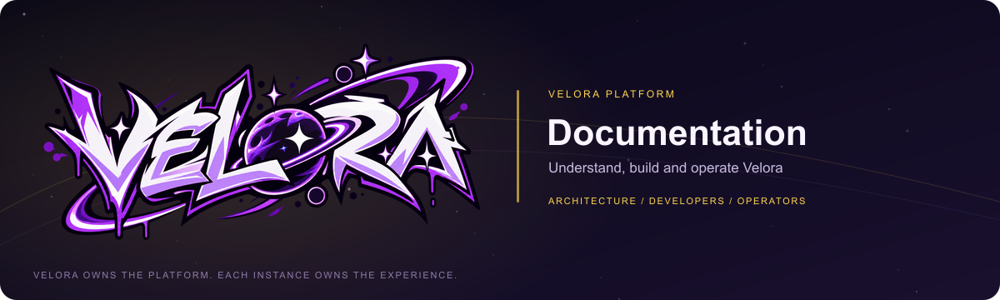

  

# Velora Documentation

  

The shared reference for Velora’s architecture, repository ownership and migration. Developers and operators can follow the current evidence instead of inferring readiness from an extracted package or a passing unit suite.

**Velora owns the platform. Each instance owns the experience.**

[Migration progress](https://github.com/VeloraMCDev/docs/blob/scopedd/velora-migration/migration/CURRENT_PROGRESS.md) · [Execution plan](https://github.com/VeloraMCDev/docs/blob/scopedd/velora-migration/migration/VELORA_EXECUTION_PLAN.md)

## Start here

The new [deployment implementation guide](deployment/README.md) governs deployment
work and its ordered milestones. Read it together with the migration checkpoint.

1. **[Current progress](migration/CURRENT_PROGRESS.md)** — what is implemented, what passed and what is still incomplete.
2. **[Migration plan](migration/MIGRATION_PLAN.md)** — ownership boundaries, compatibility decisions and the target repository architecture.
3. **[Execution plan](migration/VELORA_EXECUTION_PLAN.md)** — dependencies and acceptance gates for the complete migration.
4. **[Launcher admission ADR](migration/adr/0001-launcher-admission-and-platform-observations.md)** — implemented storage/report boundaries, compatibility evidence and deferred service decisions.
5. **[Communications ADR](migration/adr/0002-provider-transport-and-account-lifecycle.md)** — generic transport ownership, preserved failure behavior and remaining service requirements.
6. **[Game authority runtime ADR](migration/adr/0003-game-authority-runtime-before-web-cutover.md)** — runnable service lifecycle and the remaining web/gateway cutover boundary.
7. **[Fixed gateway ownership ADR](migration/adr/0004-fixed-game-authority-gateway.md)** — streaming game-authority routing, failure behavior and bounded component acceptance.
7. **[Stage 1 report](migration/STAGE_1.md)** — historical foundation evidence. Its original scope/tooling statements describe that stage, not the latest state.

## Platform segments

- **SDK** defines messages, public mechanisms and local extension contracts.
- **Authentication** owns identity, launcher/game admission, sessions and cosmetics.
- **Panel** owns operator administration, instances, distribution and gateway composition.
- **Launcher** owns installation, launch and its generic application shell.
- **Minecraft Integrations** connects game runtimes and platform services.
- **Infra** owns deployment, migrations, release coordination and recovery.
- **Docs** explains these public boundaries. Private gameplay implementation and presets stay in their private owner.

## Reading a checkpoint

An independently buildable library is a concrete extraction result. It is not automatically a deployed service, a complete application or proof of every feature’s end-to-end parity. Track owner CI, host adoption, immutable-source checks, public/private composition and upgrade fixtures separately.

The migration report records the frozen source, compatible identifiers, preserved data/assets, test results and release limitations. Parent acceptance boxes stay open until their full requirements pass.

## Documentation audiences

**Developers:** public contract use, local provider/widget composition, independent builds and contribution validation.

**Operators:** eventually installation, configuration, access control, upgrades, troubleshooting and restore procedures. Standalone operational guides are not complete while the service split is in progress.

**Maintainers:** extraction provenance, ownership decisions, artifact/license disclosure and release readiness.

## Keep the reference accurate

Update checkpoints after implementation and real validation. Preserve historical stage reports; correct the current report when scope or evidence changes. Use synthetic examples and operator-supplied URLs. Never paste keys, production records or private implementation details into public documentation.

## Scope and status

The complete multi-repository migration supersedes the earlier foundation-only scope. Seven platform repositories are being prepared for open source; Experiences stays private. Repository visibility and releases have not been changed by these documentation commits.

## Migration and provenance

This is an active migration from the private SCOPENET-MC application. Frozen source revision: `57daa92cb6cb4027982d06bfa1c692ab9edb88ff`. Library/segment availability described above is distinct from complete feature-parity, upgrade and deployment acceptance. The current report records the actual validation checkpoint and remaining work.

## License and brand

Platform code uses the [MIT license](LICENSE). See [CONTRIBUTING.md](CONTRIBUTING.md) for contribution expectations. Official Velora artwork and trademarks are excluded from MIT; no separate artwork reuse grant is provided. Banner provenance is in [.github/assets](.github/assets/README.md). Repository preparation does not change visibility or publish packages.

## Explore the public platform

[Infra](https://github.com/VeloraMCDev/infra) · [Docs](https://github.com/VeloraMCDev/docs) · [SDK](https://github.com/VeloraMCDev/sdk) · [Authentication](https://github.com/VeloraMCDev/authentication) · [Minecraft Integrations](https://github.com/VeloraMCDev/minecraft-integrations) · [Panel](https://github.com/VeloraMCDev/panel) · [Launcher](https://github.com/VeloraMCDev/launcher)
