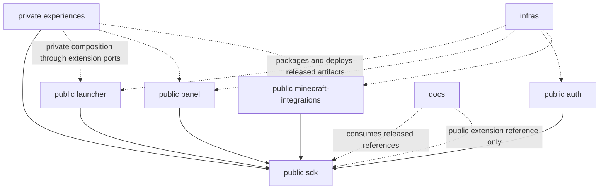

# Velora: eight-repository migration architecture

**Status: architecture proposal with stage 1 implementation authorized by the
user on 2026-10-04. See [STAGE_1.md](STAGE_1.md) for the bounded scope and evidence.**

Core principle: **Velora owns the platform. Each instance owns the experience.**

## Updated scope: public Velora platform, private experiences

The project will be rebranded from SCOPENET to **Velora**. Seven repositories
(`launcher`, `panel`, `minecraft-integrations`, `auth`, `sdk`, `infras`, `docs`)
will be public/open source; **`experiences`, including its shared gameplay code,
will remain private**. Repository visibility is unchanged; the user selected MIT
for the seven platform foundations. Artwork and private distribution terms remain open.

[VELORA_EXECUTION_PLAN.md](VELORA_EXECUTION_PLAN.md) is the actionable task tracker
for this expanded scope: migration, rebranding, open-source preparation and
self-hosting. This document remains the source ownership audit and architecture
reference. Its current source paths intentionally use historical SCOPENET names.
Use the tracker for task state, dependencies, evidence and review gates.

Every public repository must build/test without private repository or registry
access, and the public stack must support real account management, instance
installation/distribution, server connection and launching. Private gameplay is
an optional, explicitly installed extension. Public products expose SDK extension
ports; they cannot import private gameplay implementations by default. Existing
SMP/Frontiers functionality is preserved in a private composition/distribution
with its own tests and authorized artifact channel. A public synthetic reference
extension demonstrates the interface without exposing those experiences.

References below to consuming experience packages apply to **private compositions
only**. Public package manifests, CI, releases and container builds must not
require them. Independently deployable experience services and privately composed
backend/UI/Java artifacts are alternatives to settle before implementation; do not
assume Cargo optional dependencies or npm optional packages provide privacy or
independent builds. See the tracker for the public/private package and deployment
gates, compatibility rebranding policy and complete host setup requirements.

This change adds only this plan. It does not move, delete, rename, rewrite, deploy,
or extract application code. Do not start the steps below until the plan and its
architectural decisions have been reviewed.

## 1. Audit scope and conclusions

- Audited source: `main`, exact revision
  `44e28eeda13727d8a3ffb18f4a7d84cef60fbe68` (merge of the instance-first experience
  work), audited on 2026-10-04.
- The inventory covers all **795 tracked files** at that revision: Rust crates,
  Svelte applications, Java integrations, mobile shell, shared frontend modules,
  tests, examples, artwork, documentation, scripts, both CI providers, and stored
  release artifacts. Generated `target/`, `node_modules/`, `dist/`, local caches,
  and runtime data are not source repositories.
- Evidence comes from manifests, imports, build configuration, route registration,
  persistence/migration code, representative implementation modules, tests, and
  existing documentation. This is a source architecture audit, not a new runtime
  certification of every supported Minecraft version or an audit of live servers.

The biggest boundaries are inside directories, not between directories:

1. `panel/server` hosts platform APIs, authentication, Yggdrasil, and virtually all
   authoritative gameplay systems in one Rust application.
2. `integrations/common` contains both reusable server communication and gameplay
   behavior. Moving it wholesale into either SDK or integrations would retain that
   coupling.
3. `shared/` mixes wire contracts, reusable rendering, gameplay UI, and experience
   presets. Those have different owners.
4. `crates/core` is predominantly the installation/launch engine, but the panel
   imports its metadata, HTTP, hashing, and path utilities.
5. The Cargo workspace, frontend aliases, Java project dependencies, icon generator,
   documentation generator, and release workflows all assume a common checkout.
6. Instance data isolation already exists, but SQLite `ATTACH`, temporary identity
   views, shared migration history, and mixed route handlers still connect domains.

**Recommended final deployment:** a panel/control-plane container and a separate
auth container, exposed through one compatible public origin. Experience backend
packages can initially run inside the panel's experience host; their source,
policies, migrations, and UI belong to `experiences`. A separate experience worker
or service is an option to decide later, not a prerequisite for eight repositories.
Multiple Compose containers are acceptable. Eight repositories do not imply eight
services: SDK, docs, and infrastructure are not application servers.

The original audit predates the Docker temporary-directory fix. As of this plan's
scope update, `origin/main` is `57daa92cb6cb4027982d06bfa1c692ab9edb88ff`, which
includes that fix through PR #40. Preserve it when transferring image packaging.
The planning branch does not cherry-pick or modify application code. Record the
then-current main revision again before the approved extraction starts.

## 2. Current inventory and proposed ownership

Paths in this section are current paths. A destination containing several owners
means the module must be split by responsibility after review, not copied into
multiple repositories as separately maintained implementations.

### 2.1 Repository roots and build surfaces

| Current directory or file | Current responsibility | Proposed destination |
| --- | --- | --- |
| `launcher/` | Svelte desktop UI and Tauri Rust shell; accounts, installation, launch, local preferences, logs, updates, and gameplay surfaces | `launcher`; reusable contracts/rendering to `sdk`, experience pages to `experiences` |
| `panel/server/` | Axum API host, SQLite persistence, installation/control-plane administration, auth, gameplay, maps, content and integrations | `panel`, `auth`, and `experiences`, with public contracts in `sdk` |
| `panel/web/` | Admin application, public landing site, browser player panel/PWA, shared sign-in | `panel` shell and platform pages; experience editors/pages/components to `experiences`; generic reusable components to `sdk` |
| `panel/icons/` | Packs Iconify datasets; backend serves individual icons from compressed packs | `panel/icons`; packaging of built output in `infras` |
| `mobile/` | Capacitor Android/iOS wrapper around the hosted browser player panel; icon/splash, URL configuration, fallback HTML | `panel/apps/mobile`, not the Tauri launcher; native build/signing orchestration in `infras` |
| `crates/shared/` | Rust wire types, identity helpers, experience contract, launcher update contract/version comparison | `sdk` Rust packages |
| `crates/core/` | Minecraft install/launch engine and utilities, also consumed by panel metadata/imports | Engine to `launcher`; genuinely shared metadata/network/path helpers to `sdk` |
| `integrations/` | Java server/client loader implementations, common runtime, plugin APIs, adapters, tests and versioned mixins | `minecraft-integrations`, plus platform-neutral contracts to `sdk` and gameplay rules to `experiences/shared` |
| `shared/experience/` | Branding/experience types, capability lists, navigation policy, SMP/Frontiers presets and widget renderer/registry | Contract and generic host in `sdk`; presets, page policy, registry contributions and Frontiers widget in `experiences` |
| `shared/map/` | Map DTOs, canvas renderer, live feed and Svelte viewer | DTOs and reusable renderer in `sdk`; claim/action policy and experience overlays in `experiences` |
| `shared/casino/` | Casino games, animation, preferences, sound, host adapter and casino response shapes | Game UI/behavior in `experiences/shared/ui/casino`; public response contracts in `sdk` |
| `shared/board/` | Orders/contracts UI, catalog suggestions, formatting and transport host adapter | Gameplay UI/catalog in `experiences/shared/ui/board`; wire contracts in `sdk` |
| `shared/commands/` | Command descriptions, aliases and permission nodes consumed by UIs and generated docs | Experience command catalog in `experiences/shared`; neutral command schema in `sdk` |
| `branding/` | Canonical platform SVG marks and icon-generation instructions | Versioned platform asset package in `sdk`; instructions in `docs`; experience-specific art belongs in `experiences` |
| `examples/` | Example Paper, Fabric server and Fabric client configuration | Executable/config examples with `minecraft-integrations`; project-wide walkthroughs in `docs` |
| `docs/` | Architecture, operations, API/user/developer guides, screenshots, companion review and experimental canvas source | `docs`, including images and review artifacts; label the canvas as an optional review artifact |
| `README.md`, `IMPLEMENTATION_SUMMARY.md` | Project entry point, feature/build documentation and historical implementation summary | Project-wide content/history in `docs`; each product gets its own scoped README |
| `Dockerfile`, `docker-compose.yml`, `.dockerignore`, `.env.example` | Panel source/prebuilt image packaging, single-panel deployment, defaults and volumes | `infras`; application configuration parsing and local development commands remain in their applications |
| `.github/`, `.gitea/` | Checks, platform builds, release coordination, asset validation and runner setup | Reusable orchestration/runner tooling in `infras`; thin trigger workflows and component checks in each owning repository |
| `scripts/ci/` | Linux/Windows runner prerequisites and toolchains | `infras/ci` |
| `scripts/demo/` | Throwaway panel startup and HTTP-based population of players, guilds, economy, quests, casino, social and heartbeats | Local runner in `panel`; reusable experience fixture payloads in `experiences`; full-stack orchestration in `infras` |
| `scripts/gen-commands-doc.mjs` | Reads the shared command catalog and writes `docs/commands.md` | Docs generator in `docs`, consuming a released experience catalog instead of a relative checkout |
| `scripts/icons/build.mjs` | One command writes launcher, mobile, panel and companion icons using Playwright and Tauri CLI | Common asset rendering tool in `sdk`; app-specific output/conversion commands stay with owners; orchestration in `infras` |
| `fix-phase.cjs`, `fix-review.cjs` | One-off source-rewriting scripts touching several applications; not normal build steps | Preserve originals in the private archive if they reveal gameplay implementation; only reviewed generic tooling goes to public `infras`. Never run automatically. |
| `release-artifacts/0.4.0`, `release-artifacts/0.5.0` | Historical installers, server/client JARs, checksums and release notes | Preserve immutable originals privately; publish only approved binary/index/redirect records through infras after checking private gameplay/artifact distribution terms. Retain bytes/hashes and authorized download continuity. |
| Root `Cargo.toml`, `Cargo.lock`, `rustfmt.toml`, `.gitignore` | One Rust workspace/version/dependency set, formatting and generated-output rules | Each Rust repository gets its own manifests/locks/config; shared conventions/templates in `infras`; no central application workspace required |

### 2.2 Rust installation engine and launcher

| Current modules | What they do | Final owner |
| --- | --- | --- |
| `core/{install,java,launch,assets,libraries,loaders/*,maven,version,rules,progress,paths,options,servers_dat,sys,sync}.rs` | Resolve Minecraft/loaders/Java, install files, apply rules, manage local storage, preserve user files, launch processes and report progress | `launcher/engine`; extract only common path validation and metadata pieces actually used elsewhere |
| `core/meta.rs`, shared portions of `http.rs` and `paths.rs` | Version/loader lookup, downloads/JSON/hash helpers, safe path handling used by panel imports | Small `sdk` metadata/net/path packages; launcher retains engine-specific cache/download orchestration |
| `core/ping.rs`, `textures.rs` | Server status ping and local Minecraft item-texture cache | `launcher/engine`; promote a neutral helper only if another real consumer requires it |
| `core/authlib.rs` | Installs/prefetches authlib-injector and constructs game JVM arguments | `launcher/engine`; metadata/session DTOs in `sdk`, server protocol/signing implementation in `auth` |
| Tauri `accounts.rs`, `secrets.rs` | Local account selection, panel/offline accounts, credential storage, encrypted secrets, remote sign-in and game auth | `launcher`; use SDK auth clients, never move OS keyring/encryption policy into the remote auth service |
| Tauri `settings.rs`, `state.rs` | Local app configuration, manifests, account/game state and selected experience | `launcher`; public DTOs in SDK, local preferences remain local |
| Tauri `game.rs`, `telemetry.rs` | Instance download/install/launch/repair, companion preferences, logs, exit reporting and launch session events | `launcher`; lifecycle/session contracts in SDK; registration/admission semantics divided between panel/auth |
| Tauri `commands.rs`, `lib.rs` | Large IPC registry covering platform and gameplay HTTP calls plus local OS actions | `launcher` IPC adapters; typed reusable HTTP clients in SDK; no authoritative gameplay rules in the launcher |
| Tauri `updater.rs` | Panel-hosted immutable update downloads plus GitHub/Gitea release fallback | `launcher`; update DTO/version comparison in SDK; artifact publishing in `infras`, hosting API in `panel` |
| Launcher `App.svelte`, `lib/{store.svelte,tauri,theme,keys,motd,textures.svelte}.ts`, `app.css` | Desktop composition, state, transport, themes/input and local rendering | `launcher`; generic shared rendering can become an SDK UI package without moving local app state |
| Launcher `Setup`, `Login`, `Settings` pages and `TitleBar`, `PlayButton`, `Console`, `CrashDialog`, `InstanceSettings`, `TexturesBanner` components | Setup, identity UX, local installation settings, launching and diagnostics | `launcher` |
| Launcher `Social` page and `SocialSidebar`, profile/sign-in/avatar/skin widgets | Shared platform identity, social relationships and profiles | Launcher adapters/shell stay `launcher`; neutral reusable UI goes to SDK; platform services remain panel/auth |
| Launcher `Home`, `Stats`, `Guilds`, `Market`, `Casino`, `Quests`, `Collections`, `Commands` and guild/claim/rank widgets | Mix experience overview/gameplay with host-local launch actions | Experience portions to `experiences`; preserve thin host adapters in `launcher` for launch, dialogs, navigation and transport |
| Launcher `types.ts`, `mock.ts`, `mockBoard.ts`, `mockCasino.ts`, format/icon/color helpers | Duplicated DTOs, browser-only mock transport and gameplay/demo data | SDK wire types; host mocks remain launcher; experience fixtures/helpers move with their domain |
| `core/tests/online.rs`, engine inline tests, Tauri inline tests, runes checker | Real installs and engine/desktop correctness | Tests follow launcher engine/shell; shared contract tests move to SDK; runner setup to infras |

The engine currently supports vanilla, Fabric, Quilt, Forge and NeoForge installs.
Do not confuse this with integration artifacts: there is no separate NeoForge or
Quilt server integration module in this snapshot.

### 2.3 Panel backend modules and routes

`routes/mod.rs` contains 388 route registrations, before separately registered
Yggdrasil routes. Preserve registered paths, methods and middleware behavior when
extracting handlers. The module list below covers every backend route module,
including mixed modules that cannot be moved wholesale.

| Current module group | Responsibility and proposed owner |
| --- | --- |
| `main.rs`, `lib.rs`, `config.rs`, `state.rs`, `error.rs`, `net.rs`, `routes/mod.rs` | HTTP composition, health/static hosting, startup/bootstrap, config and trusted proxy/IP handling. Panel owns the gateway/composition and product config. Auth owns authentication logic; SDK owns neutral contexts/errors/ports, not `AppState` or deployment secrets. |
| `db.rs`, `store.rs`, `experience.rs` | Mixed migrations, global settings/installation metadata, experience ownership, per-instance pools, legacy import, attached identity views and workers. Panel keeps instance registry/router/compatibility coordinator; domain persistence/migrations move to auth or experiences; SDK owns manifests/context/capability schemas. Split `store.rs` KV keys by their owner. |
| `auth.rs`, `yggdrasil/{mod,keys}.rs` | Argon2, JWT issuance/revocation, roles/groups, user lookup, game authentication/session joins, texture signatures and player/chat keys. Auth owns these implementations and data. Panel retains adapters for guarded control-plane routes. |
| `routes/public.rs` | Launcher manifests/files/events are panel; login/register and `signed_in` session issuance are auth. Manifest enrichment with gameplay module snapshots uses an experience provider port. |
| `routes/account.rs`, `textures.rs` | Username/password/skin/cape and saved skin-profile operations are auth; texture/image helpers may be shared selectively. Aggregated gameplay stats, online-presence checks and account-deletion coordination require panel/experience ports. |
| `routes/admin.rs` | Mixed users/groups, settings/branding, installation CRUD/import/files and stats. Panel owns the admin UI/API facade and installations; auth executes identity/group changes; experience reports are supplied through domain ports. |
| `routes/connections.rs` | Discord OAuth/account linking and reset tokens belong to auth. General email delivery/settings and branded mail are mixed with this module; split transport/config from credential workflows, as decided in D7. |
| `routes/social.rs` | Friends, DMs, game invites, public profiles and posts: panel platform service. Guild/XP/rank/online report enrichment comes from experiences and presence services, not direct foreign-table joins. |
| `routes/activity.rs`, `purge.rs`, `routes/notifications.rs` | Mixed platform audit/social notifications and gameplay event history/cleanup. Panel owns cross-domain reporting and deletion coordination; auth and experiences own their records and deletion/anonymization actions. Notifications require explicit origin/scope; no blanket move of the entire table/function. |
| `routes/landing.rs`, `launcher_updates.rs`, `mobile_apps.rs`, `meta.rs`, `icon_library.rs`, `icons.rs`, `packs.rs` | Panel landing/publishing/metadata/icon APIs and Modrinth/CurseForge/plain-instance imports. These are installation/platform services. Release signing/publishing/container staging belongs in infras; generic metadata helpers in SDK. |
| `casino.rs`, `routes/casino.rs`, `routes/casino/games.rs`, `routes/casino_admin.rs` | Authoritative game math, rounds, stakes/payouts, limits/config and casino APIs: experiences/shared casino module. |
| `routes/economy.rs`, `economy_admin.rs`, `market.rs`, `auctions.rs`, `guild_bank.rs`, `ledger.rs`, `orders.rs`, `contracts.rs` | Scoped balances, transactions, idempotent operations, market/auctions/mailbox, guild wallets, escrow, buy orders and contracts: experiences/shared economy modules. Ledger must remain transactional with its consumers. |
| `progression.rs`, `rewards.rs`, `seed.rs`, `routes/{leveling,progression,quests,achievements,rewards,collections,cosmetics,bulk,luckperms}.rs` | XP curves/ranks, quest chains/objectives, awards/unlocks, reward queue/delivery, default content and level-to-permission links: experiences/shared progression/rewards/content modules. Auth/cape catalog access is through narrow ports. |
| `routes/{guilds,guild_game,guild_flags,admin_claims}.rs` | Membership/roles/invites/relations, guild land, protection flags and admin claims: experiences/shared guild/claims modules. |
| `worldmap.rs`, `routes/{map,worldmap}.rs` | World tile storage/zoom rebuilding, signed URLs, live players, overlays and queued map actions: experiences/shared map backend; generic signing primitive may be supplied by a host port. Panel routes preserve public URLs. |
| `bbmodel.rs`, `model_view.rs`, `pack_import.rs`, `pack_safety.rs`, `content_import.rs`, `rank_glyphs.rs`, `routes/{content,resource_assets}.rs` | Custom items/blocks/furniture/mobs, resource packs, Blockbench/3D previews, glyphs and framework imports: experiences/shared content backend/editor. This is distinct from installation modpack import in `packs.rs`. |
| `routes/{chat,utilities,events}.rs` | Chat formats, commands/kits/utility configuration and community events/contributions: experiences/shared modules. |
| `routes/companion.rs` | Layouts plus a gameplay action dispatcher which calls economy, casino, guild, map, quest and social handlers. Dispatcher/gameplay belongs to experiences; trusted connected-player validation and loader channel adapters belong to integrations/panel ingress; social actions call the platform API. |
| `routes/{servers,integrations,dev_api}.rs` | Mixed server credentials/admission/heartbeat, feature reports, sync receipts, player activity/XP, claim index, developer API and remote command queues. Panel owns credential/instance registry and dispatch; auth owns account/session checks; experiences own gameplay operations/settings; integrations own game execution; SDK owns protocol/client contracts. |
| `embeds.rs`, `routes/{discord,discord_commands,discord_studio}.rs` | Discord role mapping, announcements, templates/live boards and commands combine shared identity and scoped gameplay. Panel owns platform communications/provider configuration; experience templates/data/rank-role policy and gameplay commands belong to experiences. Auth owns account link tokens. |
| `routes/emails.rs` | Platform bulk mail/templates/audiences/opt-out/logs: panel communications; account recovery semantics remain auth; experience-triggered message content remains experiences. |
| `scheduler.rs` | Common task runner plus hard-coded gameplay and maintenance jobs. Panel owns host/task-registration infrastructure; auth/experiences own task definitions and domain effects; cleanup/reporting ports replace calls into unrelated domain modules. |
| `panel/server/tests/` | Route/domain tests and shared fixtures. Split by owner, retain gateway/cross-domain tests in panel and full-stack compatibility tests in infras. Preserve mixed tests until their replacements pass; do not drop them to make extraction compile. |

### 2.4 Panel frontend and mobile

| Current surface | Proposed ownership |
| --- | --- |
| `App.svelte`, `lib/{api,router.svelte,session.svelte,toast.svelte,native,nozoom,adminNav,experience.svelte}.ts`, shell/topbar/sidebar | Panel application shell, session/navigation adapters and instance selection. SDK supplies typed clients/contracts; experiences supply registrable pages/widgets. |
| `Instances`, `InstanceEditor`, `InstanceControl`, `ExperienceEditor` | Panel control center, installation and experience configuration host. Presets/schema/editor contributions come from experiences; instance registry remains panel. |
| `Login`, `Users`, `Capes`, `Settings`, `Branding`, `Activity`, `Emails`, `LandingBuilder`, `PublicLanding`, platform portions of `Dashboard` | Panel platform/admin/public UI, using auth APIs where appropriate. Shared auth form/display primitives can be SDK UI. |
| `Servers`, `ServerDetail`, `ScheduledTasks`, `DiscordStudio`, integration and group-link editors | Panel host/registry/diagnostics UI plus experience plugin contributions; split scoped task/settings/gameplay panels rather than copy whole pages. |
| `AchievementEditor`, `AdminClaims`, `BoardAdmin`, `BulkEditor`, `Casino`, `ChatFormat`, `Commands`, `CompanionBuilder`, `ContentStudio`, `CosmeticsStudio`, `CustomItems`, `EconomyAdmin`, `Events`, `GuildsAdmin`, `LevelingAdmin`, `LuckPermsAdmin`, `Progression`, `QuestChains`, `QuestEditor`, `RewardQueue` | Experience admin modules, registered inside the panel control center. Preserve every editor/action/import/preview. |
| `play/PlayApp.svelte`, `play.css`, routing/store, platform `Launcher`, `Profile`, `Social` pages | Panel browser player shell, PWA/native-shell support and platform identity/social surfaces. |
| Player `Home`, `Experience`, `Stats`, `Wallet`, `Market`, `Guilds`, `Casino`, `Quests`, `Collections`, `Commands`, `LiveMap` | Experience pages/widgets; panel retains host callbacks and selection/session state. |
| `components/` and `play/ui/` | Generic modal/toast/avatar/skin/form/icon/chart primitives may be shared SDK UI after checking props/imports. Content/reward/guild/claim/casino/model editors and renderers belong to experiences. Download/version/server registration components stay panel. |
| `lib/types.ts`, `landingSchema.ts`, `content.ts`, `rewards.ts`, `mcData.ts`, `mcText.ts`, `mccolor.ts`, `prefixPng.ts`, `lpNodes.ts`, `achievementIcons.ts` | SDK for public schemas/neutral text/rendering; panel for landing composition; experiences for reward/content/permission catalogs and achievement semantics. Keep application-only view state out of SDK. |
| `public/` artwork and web manifest, index/build configs, mobile assets/config/fallback | Owning panel/mobile application. Consume versioned platform artwork; preserve app ID `net.scopenet.player`, PWA behavior, HTTPS/callback paths and existing mobile deep links. |

### 2.5 Minecraft integrations

| Current module/package | What it does | Proposed destination |
| --- | --- | --- |
| `integrations/api` | `ScopenetApi`, provider, player/guild/friend/quest/XP views, async plugin-facing methods and Bukkit events | SDK neutral Java API/DTOs plus an optional Bukkit API binding; implementations/event emission remain integrations. Decide compatibility packaging in D6. |
| `common/net/scopenet/integration/PanelClient.java` | HTTP transport/error handling **and** claim polling/cache coordination | Transport/client contracts to SDK Java client; claim sync/cache execution to integrations; claim interpretation rules to experiences |
| `integration/Integration`, `Activity`, `Settings`, `OperationLedger` | Admission/sync workers, retained activity batches, heartbeat settings and retry/idempotency storage | Integration runtime; wire shapes to SDK, gameplay interpretation to experiences, account admission to auth via panel ingress |
| `integration/ClaimIndex`, `ChunkCheckResult`, `ChatLayout` | Claim lookup/protection result and configured chat formatting | DTOs to SDK; reusable policy/format rules to experiences; game-side cache/thread coordination to integrations |
| `core/{Panel,PanelAdapter,PanelMessages,Wire,ClientLink,PlayerCache}.java` | Adapter facade, messages, companion connection and player cache | Neutral interfaces/wire messages to SDK; transport/connection/cache adapter implementation in integrations; gameplay-specific message rendering in experiences |
| `core/{Platform,CorePlayer,Pos,Item,ItemSpec,ContentDef}.java` | Abstract game host hooks and world/item/content models | SDK host SPI and public schemas where neutral; loader-specific execution in integrations; content behavior/config rules in experiences |
| `core/{CoreCommand,Cmd,CommandSet,CommandSuggestions,Env,Jobs}.java` | Command abstraction/registration/completion and execution environment | Neutral host SPI to SDK; loader scheduling/registration adapters to integrations; command lists/permissions/behavior to experiences |
| `core/{BoardCommands,CosmeticCommands,EconomyCommands,EssentialsCommands,EssentialsConfig,EssentialsService,GuildCommands,GuildManage,ItemValues,Limits,Placeholders,RewardRules,ShopPoints,Utilities,UtilityHub,UtilityStore,Format}.java` | Shared commands, economy/shop, guild/claims, travel/utility/kit/vault behavior and gameplay formatting/rules | `experiences/shared/java`; world/player/persistence operations through SDK host ports |
| `core/{ActionPoller,RewardPoller,ResourcePackPoller,VaultDeliveries}.java` | Scheduled remote actions, rewards/resource-pack offers and inventory delivery | Poll/ack/execute adapters in integrations; eligibility/delivery rules in experiences; DTOs/idempotency protocol in SDK |
| `core/map/*` | Overlay/models, region math, map service and sampling abstraction | DTOs/neutral geometry helpers to SDK; world-thread sampling/cache/sync adapters to integrations; gameplay overlay/action policy to experiences |
| `worldmap/*`, `block_colors.csv` | Anvil/NBT parsing, block/biome palettes, PNG tile rendering, region sampling/storage and upload | Integrations world-map producer; protocol in SDK. Do not move Minecraft file-format/rendering implementation into infrastructure. |
| `paper/` root/GUI classes | Bukkit lifecycle/commands/thread adapters, chat, client channel, custom content/cosmetics, shops and utilities | `minecraft-integrations/paper`; extract loader-independent gameplay rules, retain Bukkit inventory/entities/events code |
| `paper/compat/*` | Vault economy, LuckPerms, PlaceholderAPI, WorldGuard, CoreProtect, Spark, public API implementation and event bridge | `minecraft-integrations`; delegated policies/DTOs come from experience/SDK packages; preserve optional-plugin detection |
| `fabric/`, `forge/` | Loader lifecycle, server setup, Fabric feature/permission/item/text/command adapters and Forge hooks | `minecraft-integrations`, consuming the same versioned SDK/gameplay packages |
| `minecraft/src/{main,1.20.1,1.21.1,26}` | Shared mixins and version-specific login, commands, rules, content and server adapters | `minecraft-integrations/minecraft`; calls into experience policies through interfaces |
| `fabric-client/src/main` | Legacy 1.20.1 companion, HUD/claim borders, menus/market and server link | `minecraft-integrations/fabric-client`; experience catalogs/layout schemas are packages, not a reason to delete the legacy client |
| `fabric-client/src/26` | Modern 26.3 companion HUD/editor, dialogue/map screens, models/skins, presentation/preferences and words tests | `minecraft-integrations/fabric-client`; loader rendering remains here; reusable gameplay definitions belong to experiences |
| Gradle files/wrapper, `build-info.gradle`, descriptors/resources, common/client tests | Loader-specific source sets/remapping/shading/version metadata and tests | Local build manifests/tests in integrations (SDK/experience packages have their own Gradle manifests); reusable CI/matrix/runner setup in infras |

Important compatibility constraints: Paper uses the stable Bukkit 1.20.1 API and
Java 17 bytecode; the build/release tooling also uses newer JDKs. Fabric/Forge
legacy and modern builds use different Gradle/plugin generations, and modern 26.x
uses Java 25. The modern companion specifically targets 26.3. Preserve both source
sets and the actual release matrix; a successful Paper build is not proof that
Fabric, Forge, or either companion still works.

## 3. Proposed final repository structures

These are proposed logical structures, not instructions to create directories now.
Each repository owns its README, manifests/lockfiles, tests, changelog/versioning,
local commands and thin CI entrypoints. A developer can build it without sibling
source checkouts, using pinned published packages and documented external services.

### `launcher`

```text
launcher/
  src/                         desktop shell, platform/local pages, host adapters
  src-tauri/                   IPC, accounts/secrets, game process, settings, updater
  engine/                      extracted installation/launch Rust crate
  assets/                      generated desktop artwork
  tests/                       shell/engine/online install tests and fixtures
  tools/                       local icon/bundle and runes commands
  Cargo.toml, Cargo.lock
  package.json, package-lock.json, vite.config.ts, tsconfig.json
  .github/workflows/            component checks/release entrypoints
```

Consumes SDK Rust/TS/client/UI packages. Private compositions add released
experience UI contributions through the public extension interfaces.
The panel consumes SDK metadata helpers, never this application's engine crate.

### `panel`

```text
panel/
  server/
    src/platform/              instances, installs/imports, publishing, social,
                               landing, communications, audit and presence registry
    src/gateway/               compatible routes, auth client, trusted ingress
    src/experience_host/       scoped dispatch, module/task/page integration ports
    src/compat/                legacy route/storage/migration adapters
    migrations/platform/      new platform-owned migrations
    tests/                     platform and composition/compatibility tests
  web/                         admin/landing/player shells and platform pages
  icons/                       Iconify packing and serving inputs
  apps/mobile/                 Capacitor shell, assets, Android/iOS local config
  tools/                       local demo runner and product build commands
  Cargo.toml, Cargo.lock
  .github/workflows/
```

Consumes SDK and auth through SDK HTTP clients in the final deployment. Public
builds expose the generic experience host without private package dependencies.
Private compositions add experience backend/UI packages or a configured experience
service through those interfaces. Keeps no copy of auth implementation or gameplay
policy. The experience host is an adapter/composition root. Any legacy importer
containing private gameplay policy must stay in the private upgrade tooling, not
be published as public panel code.

### `minecraft-integrations`

```text
minecraft-integrations/
  common/                      sync/admission/transport adapters, caches/pollers
  paper/                       Bukkit adapter, compat plugins, public API provider
  fabric/                      loader/permission/world adapters
  forge/                       loader/world adapters
  minecraft/                   common and version-specific mixins/resources
  fabric-client/               legacy 1.20.1 and modern 26.3 source sets
  examples/                    server/client/plugin configuration examples
  tests/                       adapter tests and loader smoke fixtures
  gradle/, gradlew, gradlew.bat, settings.gradle, build.gradle
  .github/workflows/
```

Consumes SDK Java contracts/clients/SPI. Private compositions also consume
experiences/shared Java packages through the public integration extension SPI.
Does not require panel source to build. Communication continues through the
compatible server API; loader adapters never write panel/auth databases directly.

### `auth`

```text
auth/
  crates/
    domain/                    credentials, identity, roles/groups, sessions,
                               account lifecycle, link/reset workflows
    storage/                   auth-owned SQLite queries/migrations and key storage
    http/                      authentication/admin identity APIs and Yggdrasil
  server/                      independently runnable service/config/health
  assets/                      identity texture/cape handling inputs, if needed
  tests/                       token/session/identity/Yggdrasil/texture conformance
  tools/                       non-destructive import and validation tools
  Cargo.toml, Cargo.lock
  .github/workflows/
```

Owns credentials and auth signing material. It consumes SDK and narrow externally
implemented presence/audit/mail ports. It does not import panel or experience code.
During extraction, its packages may be temporarily linked into the existing panel
binary; the reviewed target is an independent service and auth-owned persistence.

### `sdk`

```text
sdk/
  contracts/
    platform/                  instances, files, profiles/social, updates, presence
    auth/                      public identity/auth/session/Yggdrasil schemas
    experiences/               context/capabilities and public gameplay DTOs
    integrations/              sync, admission, actions, delivery, companion, maps
    api/                       HTTP route/error definitions and compatibility rules
  rust/                        typed contracts, clients, metadata/path/net helpers
  typescript/                  generated types and reusable HTTP clients
  java/                        DTOs, async clients and game-host SPI
  bindings/bukkit-api/          optional public API/event declarations, if D6 approved
  ui/                          generic Svelte primitives, map renderer, widget host
  assets/platform-brand/       canonical shared platform artwork
  tools/                       schema generation and common asset rendering
  fixtures/                    cross-language wire/UUID/version compatibility cases
  tests/                       conformance and package independence tests
  .github/workflows/
```

SDK contains contracts, client mechanisms and reusable primitives. It must not
contain casino payout policy, XP curves, guild permissions, auth secrets, server
storage, or application state. Gameplay DTOs belong here because they cross a
boundary; their behavior/configuration defaults remain with experiences.

### `experiences`

```text
experiences/
  shared/
    rust/                      domain backend packages and owned migrations:
                               economy/ledger/market/board, casino, progression,
                               quests/rewards, guilds/claims, maps, content,
                               utilities/chat, events, companion, communications
    java/                      common game-side rules/commands using SDK host SPI
    ui/                        shared gameplay admin/player/desktop UI contributions
    catalogs/                  commands, rewards/content defaults, permission data
    fixtures/                  domain and demonstration fixtures
  smp/                         composed capabilities, branding/navigation/widgets,
                               configuration defaults and SMP-specific behavior
  frontiers/                   current preset/widget/module schema/artwork;
                               later settlement/citizen/resource rules, when built
  host-adapters/               adapters against SDK ports, never panel internals
  tests/                       domain/isolation/import/host-contract tests
  Cargo.toml, Cargo.lock        for Rust packages; separate TS/Gradle manifests
  .github/workflows/
```

Shared means reusable **gameplay**, not globally shared player state. Each enabled
module still uses an explicit instance-owned store/configuration. The currently
implemented Frontiers functionality is a preset, overview/widget and bounded live
module snapshot interface. There is no complete settlement/citizen/resource
simulation to extract from this snapshot; mark future gameplay as future work.

### `infras`

```text
infras/
  docker/                      artifact-based panel/auth images and temp/UID rules
  compose/                     documented development/production stack definitions
  deploy/                      configuration templates, health/upgrade/rollback tools
  ci/                          reusable workflows, runners, toolchain/matrix metadata
  releases/                    artifact catalog, compatibility manifests, validation
  archives/                    preserved historical release assets or immutable index
  tests/                       packaged-image and full-stack upgrade/contract smoke tests
  tools/                       stack/demo/asset orchestration
  legacy-tools/                retained one-off rewrite scripts, disabled by default
  .github/workflows/, .gitea/workflows/  provider orchestration where retained
```

Infrastructure consumes versioned application/package artifacts and verified image
digests. Repository-local workflows call reusable workflows pinned by commit.
Local application build manifests, Tauri/Capacitor/Gradle settings and dependency
lockfiles remain with their products. Existing source/prebuilt Docker build paths
need an explicit replacement/compatibility story, not silently disappearing.

### `docs`

```text
docs/
  architecture/                ownership, service boundaries, data/API diagrams
  decisions/                   reviewed architecture decision records
  development/                 per-repo setup, dependency updates, local full stack
  operations/                  deployment, auth, backups, upgrades and rollback
  user-guides/                 launcher/admin/player/gameplay/integration guides
  api/                         reference generated from released SDK contracts
  examples/                    narrative examples linking versioned runnable samples
  images/, screenshots/        existing documentation assets
  reviews/                     implementation summary, companion review/canvas
  migration/                   this plan, inventories and preservation checkpoints
  tools/                       documentation/command-reference generation and checks
  .github/workflows/
```

Project docs link to versioned source/SDK/experience releases. Only minimal local
README/build/API usage notes need to be duplicated in product repositories.

## 4. Dependencies and boundary rules

### 4.1 Current coupling

| Evidence | Current dependency | Required boundary |
| --- | --- | --- |
| Root workspace dependencies and four Cargo members | Panel/launcher import `scopenet-shared` and `scopenet-core` by filesystem path and share one version/lock | Published, pinned packages; launcher engine private to launcher; metadata/utilities separated into SDK |
| Both Vite/TS configurations | `@scopenet/{experience,map,casino,commands,board}` resolve into sibling `shared/` source; broad dev filesystem allowances | Released SDK/experience packages with exports, Svelte peer versions and independently checked type/build declarations |
| `shared/experience/components.ts` | Registry directly imports `FrontiersOverview` | Generic host accepts installed module registrations; Frontiers contributes its widget from experiences |
| `AppState`, `RequestState`, most backend route modules | Gameplay receives panel config, both pools, auth keys, HTTP client and world map; calls sibling handlers | SDK domain ports plus scoped context; immutable/minimal dependency injection; host/framework adapters separated |
| `experience.rs::open/import_legacy`, `PLATFORM_TABLES` | Experience DB connections attach platform DB and expose TEMP identity views; group mappings overlay global groups | Final domain code cannot query another repository's tables. Replace with identity/group ports and limited public projections; preserve views only in a temporary compatibility adapter |
| `db.rs`, `seed.rs`, `scheduler.rs` | One migration sequence, triggers, default gameplay content and hard-coded jobs cross domains | Owned new migration namespaces and module/task registration; unchanged historical importer/ledger until conversion is verified |
| `public::signed_in`, account/connections/admin handlers | Credential changes also issue Ygg sessions, audit activity, query presence and use shared settings/mail | Auth-owned lifecycle with typed presence/audit/mail ports and compatible panel facade |
| `servers.rs::sync/login`, `dev_api.rs`, `companion.rs` | Admission, platform identity, XP/stats, economy, quests, claims and social actions dispatched together | Panel ingress validates credential/owner; auth checks identity/session; experience modules process authorized domain operations |
| `purge.rs`, social/profile/activity reports, Discord embeds | Cross-store deletion, joins and aggregation; shared-account and gameplay histories mixed | Retryable cross-domain workflow and explicit projection/report APIs; no cross-service SQL or shared transaction assumptions |
| Java `PanelClient`, `Platform`, `Panel`, `Features` and pollers | HTTP, claim cache, server threads, gameplay rules, item/vault actions and completion catalogs intermix | SDK transport/SPI; experience rules; integration scheduling/world execution adapters |
| Gradle `project(':common')`, `project(':api')`, shading and sourceDirs | Loader JARs bundle common/API output and import versioned sibling Minecraft sources | Local loader sources remain together; published SDK/gameplay Java dependencies retain bundled class/provider compatibility |
| Launcher `commands.rs`, `game.rs`, browser/player stores | Many handwritten request paths/response types, Tauri command names, selected-instance propagation and companion JSON/channel assumptions | Typed API/companion contracts; local IPC adapters preserve command signatures and selected-instance behavior |
| `scripts/icons/build.mjs`, command-doc generator | Cross-product writes and imports relative to root checkout | Owned generators consume versioned assets/catalogs; orchestration never edits another repo's source implicitly |
| GitHub/Gitea release workflows and updater fallbacks | One version stamp, build graph and release containing installers/JARs/mobile/container; hard-coded source/provider URLs | Independent package/product versions plus tested compatibility manifest and stable public update/download redirects |

### 4.2 Final source/package dependencies

Arrows mean **depends on**. Runtime calls are described separately below.



- SDK has no source dependency on panel, auth, launcher, integrations or experiences.
- Experiences has no source dependency on those application implementations; it
  receives SDK-defined identity, storage, messaging, asset and game-host ports.
- Auth does not depend on panel or gameplay crates. Its HTTP API can call a
  platform port over the network without importing the platform implementation.
- Product CI entrypoints reference infras workflows; this is a tooling dependency,
  not a domain-code dependency. Keep interfaces/artifact formats versioned.
- No production package resolves via `../../other-repo`, a Git submodule containing
  application internals, a floating branch dependency, or an unpinned URL.
- SDK and experiences may each contain several internal language packages. This
  still produces exactly eight repositories, without a ninth UI/core repository.

### 4.3 Final runtime flow

1. Launcher, browser player/admin UI and integrations call the stable panel origin.
2. Panel/gateway routes auth and Yggdrasil requests to auth, preserving API-location
   headers, callback URLs, texture URLs and public response shapes.
3. Protected calls use auth verification/introspection and a verified principal;
   enabled/disabled account and group changes continue to affect access promptly.
4. Panel resolves the instance/server owner and constructs an authorized scoped
   context. Experience modules receive that context and their own store/config.
5. Minecraft integrations perform world/inventory/entity operations and submit
   observations or poll/ack actions using SDK protocols; experience rules decide
   authoritative gameplay state and rewards.
6. Platform reports compose identity/presence/social with scoped experience reports.
   Account deletion, role sync and communications use explicit workflows/events.

The panel remains a compatibility facade, not a second credential issuer. Service
ports are internal; public configuration can continue using a single `PUBLIC_URL`.
Do not add public auth URLs or require new game-client configuration merely because
the backend now has another container.

## 5. SDK extraction contract

The existing `crates/shared` does **not** cover every wire shape. Many additional
DTOs live in Rust route structs/JSON values, duplicated frontend `types.ts` files,
shared casino/board/map files, Java Gson messages and companion configuration.

### Types and code to centralize

| Contract family | Existing examples/sources |
| --- | --- |
| Platform presentation | `Branding`, palette/background/news/links, public landing/download schemas; `shared/experience/branding.ts` |
| Installation/distribution | `Loader`, `ServerEntry`, memory defaults, instance summary/manifest, file entry, launcher manifest/events, hashes/revisions and loader metadata |
| Identity/auth | Login/register/auth response/config, public user/profile/skin/cape, registration mode, game/session/texture metadata, stable UUID and username-format conventions |
| Experience envelope | `Experience`, features, page/widget metadata, module snapshot schema/limits, instance context and feature availability |
| Shared platform social | Friends, DMs, game invites, posts, profile views, player presence and aggregation envelopes |
| Gameplay responses | Level/server-level/reward/quest/achievement, guild/member/post/claim/role/relation, economy/transaction/baltop/listing, casino, orders/contracts, unlocks/cosmetics/events and their request/error types |
| Integration protocol | Hello/admission verdict, heartbeat/sync deltas and receipts, stat/game events, feature reports, claim revisions, action/reward delivery/ack/idempotency identifiers, resource-pack descriptors |
| Map/companion/content | Tile/zoom/dimension/live-player/overlay types, signed download descriptors, companion requests/layout/preferences/capabilities and content/item/model/resource-pack manifests |
| Updates | `LauncherUpdate`, semantic version parsing/comparison and immutable download descriptors; preserve GitHub/Gitea/panel-hosted behavior |
| Neutral client primitives | Typed endpoint calls, authentication/context propagation, timeouts/error decoding, safe path/hash helpers actually shared, Minecraft metadata helpers |
| Reusable UI/host ports | Casino/board transport shapes, widget/page host interfaces, generic modal/form/skin/avatar/map rendering; transport adapters live in the consuming apps |

### Contract requirements

- Choose and review a canonical schema source (D4). Recommended: versioned HTTP
  definitions plus JSON schemas for messages/manifests, with generated Rust/TS/Java
  models and shared fixture tests. Bootstrap from real wire behavior rather than
  treating one incomplete type file as authoritative.
- Separate public JSON/wire models, auth-internal rows, domain storage models and
  host-local view/IPC models. `UserRow`, password hashes, private JWT/key types,
  SQL pools, `AppState`, Tauri settings and deployment credentials are not SDK DTOs.
- Preserve field names, UUID formats, default/optional/null behavior, identifiers,
  timestamps, error status/body formats and serialization. Yggdrasil keeps its own
  specified error shape. Do not silently change money from current float/double
  JSON representations or rename historical `global_*` fields during extraction.
- Use `InstanceId`, `ServerId`, `PlayerId` conventions and explicit context on all
  scoped client calls. They describe ownership; they do not themselves authenticate
  a request. Only verified ingress may create a trusted execution context.
- Domain owners propose contract changes; SDK maintains interoperable versions.
  Keep additive compatibility for deployed launcher/JAR/mobile clients. Publish
  supported version ranges and verify old/new combinations before breaking changes.
- Public gameplay protocols remain in SDK even though their semantics live in
  experiences. Avoid circular dependencies where SDK imports an experience package
  just to name its public type.
- Publish public Rust packages, npm packages and Maven artifacts with immutable versions,
  pinned locks, source provenance and coordinated Svelte peer/build settings.
  Package registry/provider/license decisions are unresolved (D5/D13). Private
  experience packages/artifacts use separate access controls and never become
  prerequisites for public builds. Public schemas may expose documented extension
  protocols, but must not copy private algorithms, defaults, fixtures or artwork.

## 6. Gameplay modules for `experiences/shared`

The existing SMP functionality supplies the initial shared modules. SMP composes
them; Frontiers can enable relevant pieces without inheriting SMP's navigation,
economy assumptions, rewards or progression rules.

| Module | Existing behavior that must be preserved |
| --- | --- |
| Economy/ledger | Server/economy-group balances, adjustments/transfers, transaction history, idempotent operations, limits and admin tools |
| Market/board | Listings, auctions, bids/expiry/mailbox, buy orders/escrow, contracts/objectives/rerolls and shop interactions |
| Casino | Existing game variants, bounties/markets/bets, daily/free spins, persistent rounds, limits, math, rewards and shared animations/UI |
| Progression/rewards | Instance/server XP, level curves, titles/rank glyphs, leaderboards/stats, bonuses, reward bundles, queue/delivery/ack and permission links |
| Quests/achievements | Definitions, assignment/progress/claims, quest chains, objectives, achievements and earned history |
| Guilds/claims | Membership/roles/leadership, primary membership, invites/requests/relations, posts/emblems/banks, chunk claims, admin land and flags/protection |
| Collections/cosmetics | Unlock catalogs, equip/unequip, automatic level/achievement unlocks, templates, models and in-game cosmetic application |
| Content/resource packs | Custom item/content editors, textures/models/sounds/fonts, pack safety/version formats and framework imports; retain current import limitations |
| Maps | Scoped tile/zoom/live-player/claim overlays, map actions and travel destinations, signed access/downloads; sampler/loader execution stays integrations |
| Utilities/chat/commands | Homes/warps/spawn/back/RTP/TPA, kits/vaults/heal/feed/fly and related cooldown/permission rules, formatting and command guide/catalog |
| Events/companion | Community event contributions, instance layouts/widgets, companion dispatch and bounded module snapshots |
| Experience communication/tasks | Gameplay notifications, Discord boards/announcements/commands, scoped role mappings, scheduled domain tasks and experience fixtures |

Each module exports its backend services, public configuration schema, migration
contribution, scheduled tasks, admin/player UI contributions and optional Java
behavior. It uses SDK ports instead of reaching into panel/auth/loader internals.
Modules which share a transaction (ledger, escrow, market, reward operations) stay
within one instance storage/transaction boundary. Moving files into separate
packages must not turn one atomic operation into several unreliable remote calls.

Experience packages include declarative branding/navigation/widgets and installed
component registrations. Continue accepting manifest **data**, not executable
remote JavaScript. Generic UI can be reused while each experience controls its
pages, defaults, actions, artwork and progression display.

## 7. Persistence and lifecycle ownership

Current storage is `data/panel.db` plus `data/experiences/<instance-id>/panel.db`
and instance-owned map/assets, with historic gameplay tables retained in the root
database. Authentication currently shares that root database and key/texture files.

| Data family | Final authority |
| --- | --- |
| `users`, roles/authorization groups and membership, reserved names, auth version, credentials, Ygg tokens/sessions, player keys, link/OAuth/reset records, cape/skin identity records and signing files | Auth, exposed through identity/authorization APIs; platform profile presentation is separate |
| `instances`, installation `instance_files`, platform branding/landing/settings/publishing, server credential/owner registry, platform presence/session observation, social profiles/friendships/messages/posts/invites, platform audit/mail | Panel; gameplay-config KV keys and auth configuration are separated, not duplicated |
| Economy/market/escrow/casino, levels/quests/achievements/rewards, guild/claim/relations, content/unlocks/cosmetics, community events, scoped runtime reports/maps, instance group-role links and domain tasks | Experiences, one authoritative store per instance |
| Local game installations/saves, account selection/cache/encrypted secrets, launcher settings/manifests and companion preference files | Launcher/player machine; repository migration must not reset them |
| Server inventories/world/utility stores, retry ledgers, map-renderer caches and companion preferences | Minecraft integration/server machine; preserve persistence formats and delivery semantics |
| Deployment volumes/secrets/backup/retention and immutable release artifact records | Infras defines operations; application/domain repositories define their data schemas and migrations |

Mixed cases need explicit conversion:

- Root `game_servers` ownership/token records and instance runtime rows currently
  overlap. Keep globally allocated IDs/credentials in panel and scoped runtime
  settings/state in experiences, with explicit protocol/projections.
- `launcher_sessions` participate in authentication/admission and launch telemetry.
  Auth owns session verification/revocation semantics; panel owns launcher activity
  observations. Decide the record/interface split before separating files (D3).
- `kv`, `events`, notifications, scheduler history and email/Discord settings contain
  multiple domains. Inventory individual keys/kinds and authoritative writers,
  including legacy/unrecognized values. Preserve unknown payloads losslessly.
- Group identity/membership belongs to auth; instance LuckPerms/Discord mappings
  belong to experiences. OAuth linking is not the same operation as guild/rank sync.
- Skins/capes and signed URLs cross public origins and asset storage. Retain keys,
  content hashes, IDs, signatures and accessible existing texture URLs (D8).
- Account deletion currently coordinates active experience stores and anonymizes
  other players' records. Preserve that behavior using a retryable coordinator,
  domain-owned purge actions and explicit completion/status tracking. No fictional
  distributed SQL transaction; failed/unavailable stores must remain retryable.
- Profile/activity/Discord views aggregate identity and gameplay. Prefer explicit
  report APIs or public read projections containing UUID/display data, never
  credential replication. Cached names are acceptable only under a reviewed
  freshness policy; access checks must honor revocation/group/account changes.

Historical `PRAGMA user_version` migration order, triggers and the
`experience_storage_v1` one-time import marker must remain interpretable. Freeze
the historical sequence in a compatibility migrator before adding domain-owned
migration namespaces. Never renumber old migrations, replay XP/reward triggers,
duplicate receipts/deliveries, change the oldest-instance adoption policy, or
delete retained gameplay directories as part of repository extraction.

The complete historical migrator and any triggers/import logic implementing
private gameplay stay in the private archive/experience upgrade tooling. Public
auth/platform migrators contain only their approved owned logic and compatible
import interfaces. Do not publish private code under the label of a public
compatibility adapter; privacy review applies to old migrations and tests too.

Separating auth storage requires an explicit, non-destructive upgrade tool and
cutover checkpoint. Initially extracting source into a package can preserve the
existing database layout. Before running auth independently, replace all foreign
SQL/ATTACH assumptions, stop or coordinate old writers, copy/validate records and
key material, and establish one writer per data family. Keep the original data for
rollback; document schema/runtime rollback compatibility rather than assuming an
old binary can consume newly migrated data.

## 8. Infrastructure and release separation

Move deployment/orchestration responsibility, not every configuration file:

- Infras owns Compose, image packaging, reverse-proxy examples, internal service
  URLs, published image names/digests, volume/UID/temp-directory rules, backup and
  upgrade/rollback procedures, runner setup and shared release validation.
- Product repositories own Cargo/npm/Gradle locks, Tauri/Capacitor manifests,
  Minecraft descriptors/source sets, config parsing, local tooling and unit tests.
- Application defaults and administrator-configured gameplay/branding remain
  application/domain data. Infrastructure templates provide environment variables
  and secret references; they do not become an alternate gameplay configuration DB.
- Keep thin `.github/workflows`/`.gitea/workflows` entrypoints with their owners:
  provider triggers do not execute automatically from a different repository.
  Pin shared workflows/actions and component artifacts by reviewed revisions.
- Build products independently. Package panel binary/web/icon outputs and auth
  binary/assets using documented artifact inputs. Infras builds/deploys from those
  inputs; no Docker `COPY ../../launcher` or implicit root workspace dependency.
- Preserve installer/JAR/mobile names, checksums, hosted launcher update URLs,
  existing GHCR references and GitHub/Gitea updater fallback. Keep compatibility
  aliases/redirects when repository/release locations change.
- Replace one monorepo version stamp with component/package versions plus an
  immutable stack compatibility manifest listing SDK/experience/app versions,
  supported Minecraft/loader/Java targets and image digests. A stack release can
  coordinate versions without forcing every repository to change for one fix.
- Preserve Windows NSIS, Linux AppImage/deb, macOS DMG/universal build flows,
  Capacitor Android/iOS flows, Paper/Fabric/Forge artifacts and both companion
  variants. Keep actual optional/required release behavior visible; modern and
  legacy toolchain differences must not be flattened into a single matrix entry.
- Current GitHub prebuilt image publishing is `linux/amd64`; source Docker builds
  contain cross-compilation support for amd64/arm64. Documentation describing all
  releases as multi-arch overstates this snapshot. Decide supported publication
  targets using evidence, and validate each promised platform.
- Full-stack tests must run against **packaged** images with persistent volumes,
  non-root users and writable SQLite temporary storage, not just native unit tests.
  Preserve the merged Docker temp-directory hotfix when transferring packaging.

## 9. Architectural decisions required before migration

Recommendations below are proposals, not approvals or claims about existing code.
Record reviewed answers as ADRs in docs. If a decision is deferred, leave the
affected boundary intact until it is resolved.

| ID | Decision | Recommended direction and reason | Must be settled before |
| --- | --- | --- | --- |
| D1 | Repository independence versus runtime separation | Separate auth service in the target Compose stack; initially extract/test its source as packages. Keep experience backend packages hosted by panel initially. This gives credential ownership without requiring eight services. | Auth persistence/runtime cutover |
| D2 | Experience host/plugin interface | SDK ports/context and released backend/UI/Java packages, statically installed and registered by the host. No unrestricted remote components; independent experience workers only if workloads justify them. | Experience extraction |
| D3 | Identity, RBAC/groups, admission and launcher-session ownership | Auth owns credentials/identity/roles/groups/session verification; panel owns server owner registry/presence/install access and session observations; experiences own role mappings and gameplay. Define admission/presence methods and denial/freshness behavior. | Auth/servers/account split |
| D4 | Canonical schema and client generation | Versioned API/message schemas and cross-language fixtures, bootstrapped from actual responses and legacy clients; define codegen tooling and breaking-change process. | SDK publication |
| D5 | Package registries, coordinates and version policy | Decide npm/Cargo/Maven destinations, access/authentication, naming, Svelte peer compatibility, immutable versions and lock/update policy; use a stack compatibility manifest. | Independent builds |
| D6 | Public Java API and Bukkit coupling | SDK neutral client/API models plus optional Bukkit binding, with integrations providing runtime registration/events. Retain old Java packages/provider/class identity and compileOnly/bundling behavior; approve compatibility artifact coordinates. | Java API extraction |
| D7 | Shared mail/Discord transport versus identity/gameplay workflows | Panel owns general communications/provider administration; auth owns recovery/link lifecycle; experiences own gameplay templates/commands/rank mappings. Define a narrow delivery port/internal API and durable retry/failure behavior; avoid mandatory startup cycles. | Connections/Discord/email extraction |
| D8 | Auth data/assets/key migration and public origin | Auth-owned DB/volume and signing storage; panel/proxy keeps existing URLs and public origin. Preserve signing keys/token validity/UUIDs/texture URLs; choose introspection/cache/outage policy and import validation/cutover method. | Independent auth deployment |
| D9 | Legacy and per-instance data migration | Freeze old migrations/import policy and adopt owned migration namespaces; keep backups/markers/triggers/retained data. Approve record/key ownership and exact upgrade/rollback guarantees. | Moving persistence code |
| D10 | Social/profiles, notifications and account deletion | Platform social services in panel, identity in auth, gameplay in experiences; typed reports and retryable deletion/anonymization coordinator. Resolve notifications/event scope and membership/report freshness. | Removing cross-domain joins |
| D11 | Shared UI/artwork/catalog ownership | SDK for generic rendering/branding contract/platform artwork; experiences for gameplay UI/catalogs/presets/artwork; host-specific state/adapters in apps. Build brand/command docs from versioned packages. | Frontend/generator extraction |
| D12 | Frontiers implementation scope | Preserve its existing preset/widget/module snapshots; future settlement simulation is a distinct project. Decide schema names and module namespace/version ownership without inventing current functionality. | Frontiers package publication |
| D13 | Hosting, licenses, history and historical assets | Seven repositories will be public/open source and experiences private. Confirm organization/coordinates, licenses, GitHub/Gitea support and filtered-history strategy. Audit public history, artifacts and generated outputs for private gameplay; preserve original archives privately and approve legacy binary distribution before publishing. No project LICENSE file is present in the audited snapshot. | Creating/publishing new repositories |
| D14 | Deployment/release compatibility guarantees | Approve service health/readiness, minimum compatible client/server versions, exact Minecraft/JDK/Gradle/platform matrix, image names/redirects and data rollback policy. Permit additional containers while documenting one public endpoint. | First split-stack release |

## 10. Step-by-step migration order after review

Each step is a reviewable change with a preservation gate. Do not combine file
extraction, contract redesign, database conversion, and public URL changes into one
unreviewable switch. No step below has been performed by this planning change.

| Step | Work | Dependencies and completion gate |
| --- | --- | --- |
| 0. Review | Review this plan, resolve blocking ADRs, confirm the eight names and runtime target. | Explicit plan review before migration work starts. |
| 1. Freeze baseline | Reconcile main/outstanding branches including Docker hotfix. Record exact commit, file ownership/provenance manifest, build commands, artifact hashes and feature/API/data compatibility matrix. Capture representative legacy and current persistent fixtures. | Every tracked source/resource/test/example/artifact has an owner or explicit retained-history status; existing behavior/build failures are documented rather than silently discarded. |
| 2. Establish coordination | After approval, create repository/access/registry skeletons and infras/docs coordination conventions. Publish package/reusable-workflow conventions and stack version manifest shape. | D5/D13; no product switched yet. Build/rollback documentation and credentials/access reviewed. |
| 3. Extract SDK contracts | Package existing Rust/TS/Java wire models/helpers, enumerate route-local JSON/companion shapes, add common fixtures and compatible clients. Preserve compatibility exports while monorepo consumers transition. | D4/D6; cross-language fixtures and old clients prove byte/shape compatibility; SDK builds without application source. |
| 4. Separate shared utilities from engine | Extract metadata/safe-path/hash/net helpers used by panel into SDK. Move the remaining engine with launcher at its extraction step; replace panel imports of engine internals first. | Panel no longer needs launcher engine code; install/meta/import safety and real loader behavior preserved. |
| 5. Define experience ports and packages | Introduce SDK context/identity/storage/game-host/report/delivery ports. Extract shared gameplay in cohesive transaction groups, with temporary panel facades. Separate owned migrations/default catalogs/tasks from host composition. | D2/D9; domain tests and persistent instance isolation/restart/import tests pass; experience packages do not import panel/auth types. |
| 6. Extract auth implementation | Move credential/Yggdrasil/identity/lifecycle code into auth packages with owned query/migration APIs, initially callable from current host. Split mixed account/public/admin/connections handlers through facade ports. | D3/D7/D8; original hashes, UUIDs, sessions/keys, group/access checks, OAuth/reset/skin/cape behavior and Yggdrasil conformance preserved. No data/runtime split yet. |
| 7. Establish panel repository | Extract control-plane/platform backend, shells, icon packs, mobile wrapper, local tooling and composition tests. Consume released SDK/experience/auth packages temporarily where required. Track every compatibility adapter. | All installation/import/publishing/social/admin/player/mobile capabilities remain; no relative monorepo imports outside approved temporary adapters. |
| 8. Extract reusable and experience UI | Publish SDK generic UI/map/widget host and experience admin/player/desktop packages; move catalogs/presets/Frontiers widget and fixtures. Keep host navigation/IPC/transport/local state in panel/launcher. | D11/D12; both Svelte type/runes/build checks pass independently; all pages/actions and instance branding/navigation/capability behavior remain. |
| 9. Establish launcher repository | Extract Tauri shell and installation engine; replace shared source aliases and handwritten reusable client pieces with published packages. Preserve local files/settings/secrets/cache and update fallback URLs. | SDK/utilities/UI ready; desktop/platform builds, IPC compatibility, game launch/repair/offline flow and update checks pass; no backend source needed. |
| 10. Establish integrations repository | Extract loader sources, public API runtime adapters, mixins/map producers/examples. Consume SDK Java and experience Java packages; preserve bundled API compatibility, retry ledgers, polling and world-thread execution. | D6; test/build real legacy/modern loader matrix and optional plugins; retain server/client IDs, descriptors, permissions, companion channels/config and delivery acknowledgements. |
| 11. Remove database boundary coupling | Replace remaining foreign-table queries/TEMP views with auth APIs/public projections/SDK ports. Partition mixed KV/event/notification/session ownership; implement validated import and retryable lifecycle/report workflows. | D3/D8/D9/D10; all old/current fixtures retain exact balances/XP/history/identities/assets; live revocation and unavailable-service cases are tested. One authoritative writer per data family. |
| 12. Deploy independent auth and stack packaging | Run auth service with its own volume; expose compatible routes via panel/proxy. Transfer image/Compose/release orchestration to infras with pinned artifact inputs and non-destructive upgrade/rollback tools. | D1/D14; packaged-image startup/temp access, original-volume upgrade, readiness, trusted proxy/IP/admission, Yggdrasil/signatures/callback URLs, restarts and rollback validation pass. Additional containers allowed. |
| 13. Promote independent releases/docs | Publish tested package/component versions and stack manifest; switch consumers/update links/CI triggers; migrate all project guides/reviews/screenshots and generated API/command references to docs. | Every independent repository builds using released dependencies; old/new client compatibility and download locations work; artifacts/checksums and all documentation retained. |
| 14. Retire compatibility facades deliberately | Remove temporary monorepo/SQL/adaptor paths only after equivalents pass and supported consumers upgrade. Archive the original repository/history and record remaining compatibility obligations. | Separate reviewed deprecation change; no deletion of unported functionality, legacy artifacts or player data. |

Independent source extraction and runtime/database splitting intentionally happen
at different checkpoints. Auth may briefly remain a linked package in step 7, but
the final panel must use its service API. Temporary compatibility dependencies
must have owners and removal criteria; they must not become permanent hidden
cross-repository coupling.

## 11. Functionality-preservation and acceptance checklist

Before approving each cutover, compare the baseline with the target, including
features absent from the primary SMP/admin happy path:

- **Identity:** admin bootstrap, panel/offline accounts, stable/reserved UUID/name
  rules, registration/approval/disabled users, password hash/reset, Discord OAuth,
  group membership/access, Yggdrasil authenticate/refresh/validate/join/hasJoined,
  profile signatures, skins/capes/saved profiles and player/chat certificates.
- **Platform/launcher:** manifests, visibility/groups, all modpack/file import
  paths, Java/loaders/natives/assets, sync preserving user files, settings/keybinds,
  Quick Play/server injection, companion preferences, logs/crash/repair/offline
  behavior, telemetry, native secrets and hosted/GitHub/Gitea update flows.
- **Control plane:** all platform and instance admin pages, content/model previews,
  file/upload/download serving, Iconify library, branding/news/landing, publishing,
  health checks, mobile/PWA shells, audit/social/reporting, email/Discord tools.
- **Gameplay:** every module in section 6, default content/config, command aliases
  and permission nodes, claims/map/signing, reward/delivery/operation idempotency,
  scheduling, existing casino variants, guild workflows and retained history.
- **Instances:** switching resets scope, disabled capabilities return compatible
  errors without deleting data, credentials select the correct owner, hidden and
  disabled access is enforced, maps/resource-pack URLs work without custom game
  headers, oldest-instance legacy adoption runs once and module snapshots stay bounded.
- **Minecraft:** Paper plus optional Vault/LuckPerms/PlaceholderAPI/CoreProtect/
  WorldGuard/Spark integrations, Fabric/Forge versioned mixins, legacy/modern client
  companion behavior, inventory/utility caches and acknowledgements after restart.
- **Storage/operations:** fixture upgrades from historical supported versions,
  keys/assets/IDs preserved, no credential replication, atomic money/reward effects,
  non-root container volume permissions, writable temp storage, auth outage/retry,
  readiness, backup/restore and schema-compatible rollback procedures.
- **Repository/builds:** no sibling source dependency, no duplicated maintained
  contracts/domain rules, owner-local tests/locks/scripts, pinned released packages,
  reachable historical downloads, license/provenance records and CI provider parity
  for every provider retained by decision.

Use the existing Rust domain/API/identity/Yggdrasil/instance tests, core online
install tests, both frontend check/build/runes checks, shared experience tests,
Java common/client tests, release-asset validator tests and loader matrix as the
starting suite. Add meaningful boundary/upgrade/client-conformance tests where
extraction changes behavior. Full-stack tests belong in infras; unit/domain tests
belong with their implementation. Do not merely reduce test coverage to match
the new directories.

## 12. Review outcome to record

The review should approve or amend the ownership map, all eight structures,
blocking ADRs, package/service interfaces, migration order and preservation gates.
Record unresolved decisions with a responsible owner and the step they block.
Until that review is complete, implementation remains in the existing monorepo
and this document is the only migration-related repository change.

## Stage 1 update — 2026-10-04

The user authorized first-stage implementation and chose MIT for the seven public
platform repositories. All targets are under `https://github.com/VeloraMCDev`.
The logical names `auth` and `infras` used above map to actual repositories
`authentication` and `infra`. The other six names are unchanged.
Source baseline is now `57daa92cb6cb4027982d06bfa1c692ab9edb88ff`, including
the Docker temporary-directory fix. See [STAGE_1.md](STAGE_1.md) and the updated
execution tracker for completed subtasks and remaining gates. No running
application/gameplay source or persistent identities have been migrated yet.
