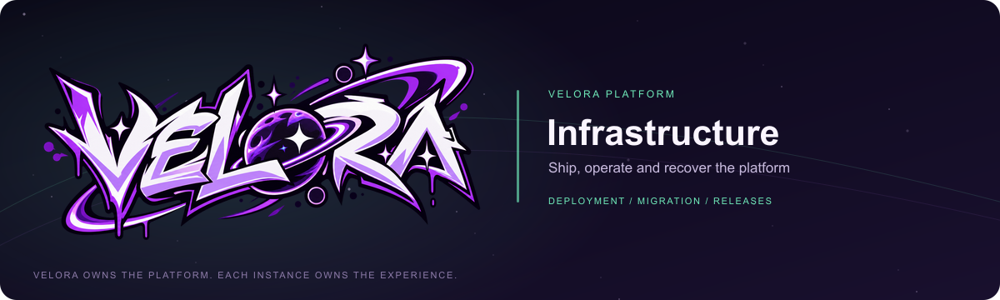

> Historical introduction; use README.md for current monorepo commands.

  

# Velora Infrastructure

   

The operational home for Velora: tested native/container game-authentication and gateway recipes, synthetic component acceptance, public source preflight and migration evidence. Complete application deployment and coordinated releases remain in migration.

**Velora owns the platform. Each instance owns the experience.**

[Migration progress](https://github.com/VeloraMCDev/docs/blob/scopedd/velora-migration/migration/CURRENT_PROGRESS.md) · [Execution plan](https://github.com/VeloraMCDev/docs/blob/scopedd/velora-migration/migration/VELORA_EXECUTION_PLAN.md) · [Checks](https://github.com/VeloraMCDev/infra/actions/workflows/preflight.yml)

## Available evidence

- **[Source inventory](migration/source-inventory.json)** — paths and SHA-256 hashes for all 796 tracked files at the frozen source revision. Mixed owner assignments remain provisional.
- **[HTTP baseline](migration/http-baseline.json)** — captured route inventory for compatibility review, with 391 registrations in the recorded source.
- **[Current progress](migration/CURRENT_PROGRESS.md)** — owner extraction, validation evidence and outstanding acceptance gates.
- **[Inventory notes](migration/README.md)** — interpretation, privacy boundary and why pending final paths do not authorize publication.
- **[Native game-auth recipe](recipes/authentication-native)** — pinned public source build, fresh development startup and health checks with explicit limits before full-stack cutover.
- **[Gateway component recipes](recipes/game-auth-gateway/README.md)** — pinned native and non-root/read-only Compose composition with outage and offline restore checks.
- **[Acceptance and source preflight](tests/README.md)** — real-process/container checks plus tracked dependency, snapshot, artifact and reachable-history checks that redact credential candidates.

The inventory contains evidence, not an imported application, container image or production data backup.

## Deployment segments to own

- **Public stack** — Authentication, Panel/gateway and supporting public components, usable without private repository access.
- **Optional private composition** — separately installed experience implementations and their owned persistence.
- **Operator recipes** — self-hosted/container, native/shared-host and game-control-panel environments where supported.
- **Release infrastructure** — coordinated versions, artifact checks, signing/updater handoff and package publication gates.
- **Recovery tooling** — preflight, dry run, protected backups, resumable import and rollback/restore verification.

## Current operational status

Pinned native and two-component Docker Compose game-authentication/gateway recipes are available in [recipes/game-auth-gateway](recipes/game-auth-gateway/README.md). Synthetic real-process and container checks cover fresh installation, outages and offline restoration into separate owned storage. Complete Panel/private composition, production cutover, legacy upgrades and deployment profiles remain pending. Existing full-application deployment instructions still apply to the private compatibility host.

Original data paths, volumes, SQLite identities, signing assets and native/updater IDs must be preserved unless a tested upgrade explicitly changes them. Deployment configuration must use operator-owned URLs and keep production secrets outside Git.

## Work with the evidence

Read [migration/README.md](migration/README.md) and compare checkpoints against [Docs](https://github.com/VeloraMCDev/docs). Validate counts/hashes and owner provenance before assembling artifacts. Full fresh-cache public/private builds, runtime upgrades, backup/restore and readiness/outage acceptance remain outstanding.

## Release readiness

Repository preparation does not change visibility, merge review branches, deploy services or activate releases. Those actions require the corresponding implementation and acceptance evidence.

## Migration and provenance

This is an active migration from the private SCOPENET-MC application. Frozen source revision: `57daa92cb6cb4027982d06bfa1c692ab9edb88ff`. Library/segment availability described above is distinct from complete feature-parity, upgrade and deployment acceptance. The current report records the actual validation checkpoint and remaining work.

## License and brand

Platform code uses the [MIT license](LICENSE). See [CONTRIBUTING.md](CONTRIBUTING.md) for contribution expectations. Official Velora artwork and trademarks are excluded from MIT; no separate artwork reuse grant is provided. Banner provenance is in [.github/assets](.github/assets/README.md). Repository preparation does not change visibility or publish packages.

## Explore the public platform

[Infra](https://github.com/VeloraMCDev/infra) · [Docs](https://github.com/VeloraMCDev/docs) · [SDK](https://github.com/VeloraMCDev/sdk) · [Authentication](https://github.com/VeloraMCDev/authentication) · [Minecraft Integrations](https://github.com/VeloraMCDev/minecraft-integrations) · [Panel](https://github.com/VeloraMCDev/panel) · [Launcher](https://github.com/VeloraMCDev/launcher)
